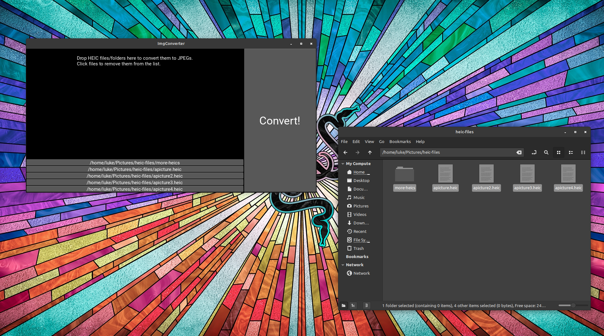

# heic-converter

A simple GUI tool for converting many HEIC images into JPEGs quickly.



## Backstory

I had a friend who frequently needed to convert large amounts of `.heic` (and `.heif`) images into JPEGs, so I made this tool to do it very quickly, and for very large amounts of files at once.

For this intended purpose, it will indeed get the job done. You can drop lots of files, or even better, an entire directory full of `.heic` files and JPEG copies will be made into the `~/h2j-converts` folder.

I thought about polishing this up to deploy it as a web app for people to use, but then I realized that Kivy (the Python library I used to make the UI) kind of sucks. So instead, I am simply releasing it here for anyone interested.

## Using the app

Maybe I will do a PyInstaller setup and a proper release for this if I feel like it, but for now you can use this tool by just cloning the repo down as follows:

```bash
# Clone the repo and enter the directory.
git clone https://github.com/LukeDSchenk/heic-converter.git
cd heic-converter

# Create and activate a virtual environment (or you can install to your system Python files, it's your life big dog 🤙🥴🤙)
python3 -m venv venv
source venv/bin/activate

# Install the Python requirements
pip3 install -r requirements.txt

# Run the program
python3 src/main.py
```
